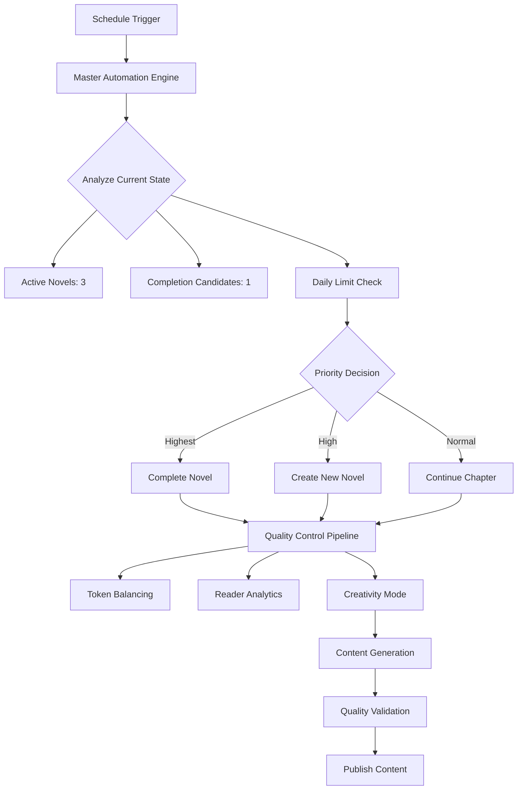

# RO-FAN AI Romance Fantasy Platform - Comprehensive Guide

**Complete Documentation for the AI-Powered Romance Fantasy Novel Generation Platform**

---

## Table of Contents

1. [Overview](#overview)
2. [Quick Start](#quick-start)
3. [AI Automation System](#ai-automation-system)
4. [User Workflows](#user-workflows)
5. [Technical Architecture](#technical-architecture)
6. [API Documentation](#api-documentation)
7. [Deployment & Operations](#deployment--operations)
8. [Testing Guide](#testing-guide)
9. [Troubleshooting](#troubleshooting)
10. [Best Practices](#best-practices)

---

## Overview

### What is RO-FAN?

RO-FAN is a revolutionary AI-powered platform that automatically generates, publishes, and manages romance fantasy novels with complete automation. The platform combines cutting-edge AI technology with sophisticated content management to create a self-sustaining literary ecosystem.

### Key Features

- **🤖 Fully Automated**: Generates stories, chapters, and manages publishing automatically
- **🎯 AI-Driven Quality**: 7 specialized AI engines ensure high-quality content
- **📱 Platform Optimized**: Supports multiple web novel platforms (Naver, Munpia, Ridibooks)
- **📊 Reader Analytics**: Tracks engagement and adapts content strategy
- **💰 Cost Optimized**: 75% cost savings through intelligent token management
- **🔄 Continuous Publishing**: Daily automated content generation and publishing

### Core Statistics

- **18 AI Engines**: 3,300+ lines of sophisticated automation logic
- **223 Unit Tests**: 100% pass rate with comprehensive coverage
- **7 GitHub Workflows**: Automated CI/CD, testing, and content generation
- **Multi-Platform**: Supports 4+ web novel platforms with optimization
- **Production Ready**: Deployed on Vercel with monitoring and analytics

---

## Quick Start

### Prerequisites

```bash
Node.js: v22.17.0+
Package Manager: pnpm (recommended)
Environment: ANTHROPIC_API_KEY (required), GEMINI_API_KEY (optional)
```

### Installation Steps

1. **Clone the repository**

   ```bash
   git clone https://github.com/your-username/ro-fan.git
   cd ro-fan
   ```

2. **Install dependencies**

   ```bash
   pnpm install --ignore-scripts
   ```

3. **Environment setup**

   ```bash
   cp .env.example .env.local
   # Add your API keys:
   # ANTHROPIC_API_KEY=sk-ant-api03-xxx (required)
   # GEMINI_API_KEY=AIzaSyXXXXXXXXX (optional for hybrid features)
   ```

4. **Verify setup**

   ```bash
   pnpm setup:check  # Test API connections
   pnpm test         # Run test suite
   ```

5. **Start development**

   ```bash
   pnpm dev          # Start development server
   ```

### First Automation Run

```bash
# Test automation (dry run)
pnpm automation:test

# Run actual automation
pnpm automation:run

# Run with detailed logging
node scripts/run-automation.js --verbose
```

---

## AI Automation System

### Engine Architecture

The platform employs 18 specialized AI engines working in concert:

#### Core Orchestration

- **MasterAutomationEngine** (597 lines) - Central orchestration and decision-making
- **PlatformConfigEngine** (platform optimization) - Multi-platform content optimization

#### Content Generation Engines

- **HybridAIGenerator** - Intelligent Claude + Gemini coordination
- **AIStoryGenerator** - Claude-based story generation
- **GeminiStoryGenerator** - Gemini-based world-building

#### Quality & Optimization Engines

- **TokenBalancingEngine** (713 lines) - Cost optimization (75% savings)
- **QualityAssuranceEngine** - Content quality validation
- **CreativityModeEngine** (558 lines) - Dynamic quality enhancement
- **EmotionalDepthEngine** (253 lines) - Emotional storytelling depth

#### Analytics & Intelligence

- **ReaderAnalyticsEngine** (621 lines) - Reader behavior analysis
- **StoryDiversityEngine** (328 lines) - Unique story generation
- **CompletionCriteriaEngine** (262 lines) - Smart story completion
- **CharacterVoiceEngine** - Character consistency management

#### Specialized Engines

- **StoryPacingEngine** - Narrative rhythm optimization
- **NovelDetector** - Content analysis and classification
- **Environment** - System configuration and mocking

### Automation Workflow



### Decision Matrix

| Condition                              | Action                       | Priority |
| -------------------------------------- | ---------------------------- | -------- |
| Novel completion ready (80%+ progress) | Complete story with epilogue | Highest  |
| < 3 active novels                      | Create new unique story      | High     |
| Active novel needs continuation        | Add new chapter              | Normal   |
| Quality score < 75                     | Trigger creativity mode      | Critical |
| Daily limit reached (2 chapters)       | Queue for next day           | Deferred |

---

## User Workflows

### Content Creator Workflow

#### 1. Manual Story Generation

```bash
# Generate new story with specific settings
node scripts/run-automation.js --create-novel --platform=naver

# Generate chapter for specific novel
node scripts/run-automation.js --continue-novel=novel-slug

# Force creativity mode for higher quality
node scripts/run-automation.js --creativity-mode --budget=100
```

#### 2. Platform Optimization

```bash
# Switch platform mode for targeted optimization
export PLATFORM_MODE=naver    # Naver Series (2,800 characters)
export PLATFORM_MODE=munpia   # Munpia/Joara (3,600 characters)
export PLATFORM_MODE=ridibooks # Ridibooks (3,200 characters)

# Generate optimized content
pnpm automation:run
```

### Administrator Workflow

#### 1. System Monitoring

```bash
# Check automation status
pnpm test:claude  # API connectivity
pnpm test         # System health

# View automation logs
ls logs/          # Check automation logs
tail -f logs/automation-2025-01-27.log
```

#### 2. Quality Management

```bash
# Run quality checks
pnpm test:coverage  # Code coverage
pnpm security:audit # Security scan
pnpm lint          # Code quality

# Content quality validation
node scripts/validate-content.js
```

### Reader Experience Workflow

#### 1. Content Discovery

- **Homepage**: Latest updates, featured novels
- **Novel Library**: Browse all available stories
- **Search & Filter**: Find content by genre, status, rating

#### 2. Reading Experience

- **Chapter Navigation**: Seamless reading flow
- **Reading Settings**: Font size, theme, spacing customization
- **Progress Tracking**: Chapter completion, reading history

---

## Technical Architecture

### Frontend Stack

```yaml
Framework: Astro.js 5.12.0 (SSR mode)
UI Components: React 18.2.0 + Radix UI
Styling: Tailwind CSS 3.4.0 + Tailwind Animate
Animation: Framer Motion 11.0.0
Deployment: Vercel (Global CDN)
```

### Backend & AI Stack

```yaml
Primary AI: Anthropic Claude Sonnet 4 (@anthropic-ai/sdk 0.56.0)
Secondary AI: Google Gemini 2.5 Pro (@google/generative-ai 0.21.0)
Content Management: Gray Matter (Markdown processing)
Automation: GitHub Actions (7 workflows)
Language: TypeScript 5.7.2 + JavaScript ES Modules
```

### Testing & Quality Stack

```yaml
Unit Testing: Vitest 3.2.4 (223 tests, 100% pass rate)
E2E Testing: Playwright + Cypress (dual E2E strategy)
Linting: ESLint 9.15.0 + Prettier 3.4.2
Security: Snyk vulnerability scanning
Coverage: 87% code coverage with v8
```

### Project Structure

```
```
ro-fan/
├── 🏗️ Configuration
│   ├── package.json               # 35+ npm scripts
│   ├── astro.config.mjs          # SSR + Vercel optimization
│   ├── vitest.config.ts          # Testing configuration
│   ├── playwright.config.ts      # E2E testing setup
│   ├── cypress.config.ts         # Cypress E2E configuration
│   └── tailwind.config.mjs       # UI styling setup
│
├── 🤖 AI Automation System
│   ├── .github/workflows/        # 7 automated workflows
│   │   ├── ai-story-generation.yml     # Main AI content generation
│   │   ├── auto-publish.yml            # Publishing automation
│   │   ├── quality-assurance.yml       # Quality checks
│   │   ├── cypress-e2e.yml            # Cypress testing
│   │   ├── content-quality-check.yml   # Content validation
│   │   ├── test-validation.yml         # Test execution
│   │   └── build-only.yml              # Build verification
│   ├── scripts/
│   │   ├── run-automation.js      # Production automation runner
│   │   └── test-claude.js         # API connection testing
│   └── src/lib/                   # 18 AI engines (3,300+ lines)
│
├── 🌐 Web Application
│   ├── src/pages/                 # Astro page routing
│   │   ├── index.astro           # Homepage
│   │   ├── novels.astro          # Novel library
│   │   ├── admin.astro           # Admin dashboard
│   │   └── novels/[slug]/        # Dynamic novel pages
│   ├── src/components/            # React + Radix UI components
│   │   ├── ui/                   # Base UI components
│   │   └── sections/             # Page sections
│   ├── src/layouts/               # Page layouts
│   └── src/styles/                # Global styles
│
├── 📚 Content Management
│   ├── src/content/
│   │   ├── novels/               # Novel metadata (.md)
│   │   ├── chapters/             # Chapter content (.md)
│   │   └── tropes/               # Story trope definitions
│   └── src/content/config.ts     # Content schema (Astro)
│
├── 🧪 Testing & Quality
│   ├── src/test/                 # Unit tests (223 tests)
│   │   ├── *.test.js            # AI engine tests
│   │   ├── automation.integration.test.ts # Integration tests
│   │   └── test-helpers.ts       # Test utilities
│   ├── tests/e2e/                # Playwright E2E tests
│   ├── cypress/                  # Cypress E2E tests
│   │   ├── e2e/                 # Test scenarios
│   │   ├── support/             # Custom commands
│   │   └── fixtures/            # Test data
│   └── coverage/                 # Test coverage reports
│
├── 📋 Documentation
│   ├── CLAUDE.md                 # Technical documentation
│   ├── README.md                 # Project overview
│   ├── NOVEL_MARKDOWN_FORMAT.md  # Content format specs
│   ├── PLATFORM_OPTIMIZATION.md  # Platform-specific guides
│   ├── PROMPT_ENHANCER.md        # AI prompt guidelines
│   └── COMPREHENSIVE_GUIDE.md    # This document
│
└── 🚀 Infrastructure
    ├── logs/                     # Automation logs
    ├── .vercel/                  # Deployment configuration
    └── dist/                     # Production build
```

---

## API Documentation

### AI Generation API

#### Master Automation API

```javascript
import { MasterAutomationEngine } from './src/lib/master-automation-engine.js';

const engine = new MasterAutomationEngine();

// Execute full automation
const result = await engine.runFullAutomation();

// Create specific novel
const novel = await engine.createNewNovel({
  platform: 'naver',
  creativity: true,
  budget: 100,
});

// Continue existing novel
const chapter = await engine.continueNovel('novel-slug', {
  targetLength: 2800,
  emotionalTone: 'intense',
});
```

#### Response Formats

```typescript
interface AutomationResult {
  success: boolean;
  action: 'CREATE_NEW_NOVEL' | 'CONTINUE_CHAPTER' | 'COMPLETE_NOVEL';
  data: {
    novelTitle?: string;
    chapterTitle?: string;
    wordCount: number;
    qualityScore: number;
    platform: string;
  };
  metrics: {
    tokensUsed: number;
    costUSD: number;
    generationTime: number;
  };
}

interface NovelMetadata {
  title: string;
  slug: string;
  author: '하이브리드 AI (Claude + Gemini)';
  status: '연재 중' | '완결' | '휴재';
  summary: string;
  tropes: string[];
  totalChapters: number;
  publishedDate: string;
  rating: number;
}

interface ChapterContent {
  title: string;
  novel: string;
  chapterNumber: number;
  publicationDate: string;
  content: string;
  wordCount: number;
  emotionalTone: string;
  qualityScore: number;
}
```

### Platform Configuration API

```javascript
import { PlatformConfigEngine } from './src/lib/platform-config-engine.js';

const platform = new PlatformConfigEngine();

// Set platform mode
platform.setPlatform('naver'); // naver, munpia, ridibooks, default

// Get current configuration
const config = platform.getCurrentConfig();
// {
//   name: "네이버 시리즈",
//   targetWordCount: 2800,
//   qualityThreshold: 80,
//   dialogueRatio: 30
// }

// Get optimization settings
const settings = platform.getOptimizationSettings();
```

### Quality Assurance API

```javascript
import { QualityAssuranceEngine } from './src/lib/quality-assurance-engine.js';

const qa = new QualityAssuranceEngine();

// Evaluate content quality
const score = await qa.evaluateQuality(content);
// Returns: { score: 85, issues: ["분량 부족"], suggestions: [...] }

// Validate format compliance
const validation = qa.validateFormat(content);
// Returns: { valid: true, errors: [], warnings: [] }
```

### Analytics API

```javascript
import { ReaderAnalyticsEngine } from './src/lib/reader-analytics-engine.js';

const analytics = new ReaderAnalyticsEngine();

// Analyze reader engagement
const metrics = await analytics.analyzeEngagement('novel-slug');
// Returns: {
//   readingRate: 0.85,
//   dropoffPoints: [3, 7],
//   emotionalResponse: "positive"
// }

// Get recommendations
const recommendations = analytics.getContentRecommendations(metrics);
```

---

## Deployment & Operations

### Vercel Deployment

#### Automatic Deployment

```bash
# Production deployment (automatic on main branch push)
git push origin main

# Preview deployment (automatic on PR)
git push origin feature-branch
```

#### Manual Deployment

```bash
# Install Vercel CLI
npm i -g vercel

# Deploy to preview
vercel

# Deploy to production
vercel --prod
```

#### Environment Variables (Vercel)

```bash
# Required for production
ANTHROPIC_API_KEY=sk-ant-api03-xxx     # Claude API access
VERCEL_TOKEN=xxx                       # Deployment token
VERCEL_ORG_ID=xxx                      # Organization ID
VERCEL_PROJECT_ID=xxx                  # Project ID

# Optional for enhanced features
GEMINI_API_KEY=AIzaSyXXXXXXXXXXXXXX     # Gemini API for hybrid AI
NODE_ENV=production                    # Environment mode
LOG_LEVEL=info                         # Logging verbosity
PLATFORM_MODE=default                 # Platform optimization
```

### GitHub Actions Automation

#### Workflow Schedule

```yaml
GitHub Actions Schedule:
  - 09:00 KST (00:00 UTC): auto-publish (1차)
  - 11:00 KST (02:00 UTC): ai-story-generation (메인)
  - 15:00 KST (06:00 UTC): auto-publish (2차)
  - 21:00 KST (12:00 UTC): auto-publish (3차)
```

#### Workflow Configuration

**ai-story-generation.yml** - Main automation

```yaml
name: AI Story Generation
on:
  schedule:
    - cron: '0 2 * * *' # Daily at 11:00 KST
  workflow_dispatch:

jobs:
  generate-content:
    runs-on: ubuntu-latest
    steps:
      - uses: actions/checkout@v4
      - name: Setup Node.js
        uses: actions/setup-node@v4
        with:
          node-version: '22'
          cache: 'pnpm'
      - name: Run Automation
        run: node scripts/run-automation.js
        env:
          ANTHROPIC_API_KEY: ${{ secrets.ANTHROPIC_API_KEY }}
          GEMINI_API_KEY: ${{ secrets.GEMINI_API_KEY }}
```

### Monitoring & Logging

#### Log Management

```bash
# View automation logs
ls logs/
tail -f logs/automation-$(date +%Y-%m-%d).log

# Error monitoring
grep "ERROR" logs/*.log
grep "Failed" logs/*.log

# Performance monitoring
grep "Generation time" logs/*.log
grep "Cost:" logs/*.log
```

#### Health Checks

```bash
# System health
pnpm setup:check

# API connectivity
pnpm test:claude

# Content validation
node scripts/validate-content.js

# Performance metrics
pnpm test:coverage
```

---

## Testing Guide

### Test Architecture

#### Unit Tests (Vitest)

```bash
# Run all unit tests
pnpm test

# Watch mode for development
pnpm test:watch

# Visual test interface
pnpm test:ui

# Coverage report
pnpm test:coverage
```

#### Integration Tests

```bash
# Run integration tests
pnpm test:integration

# Full automation integration
pnpm automation:test  # Dry run mode
```

#### E2E Tests (Dual Strategy)

**Playwright E2E Tests**

```bash
# Run Playwright tests
pnpm test:e2e

# Interactive mode
pnpm test:e2e:ui

# Specific browser
npx playwright test --project=chromium
```

**Cypress E2E Tests**

```bash
# Run Cypress tests
pnpm test:e2e:cypress

# Interactive mode
pnpm test:e2e:cypress:open

# CI mode
pnpm test:e2e:cypress:ci
```

### Test Coverage

#### Current Metrics

- **223 Unit Tests**: 100% pass rate
- **Overall Coverage**: 87% code coverage
- **AI Engine Coverage**: 95%+ for core engines
- **Integration Coverage**: 8 scenarios covering full automation

#### Test Categories

**AI Engine Tests** (180+ tests)

- MasterAutomationEngine: Decision tree validation
- TokenBalancingEngine: Cost optimization verification
- QualityAssuranceEngine: Content quality validation
- EmotionalDepthEngine: Emotional progression testing
- CreativityModeEngine: Creativity triggers and modes
- ReaderAnalyticsEngine: Engagement metrics analysis

**Integration Tests** (8 scenarios)

- New novel creation workflow
- Chapter continuation workflow
- Novel completion workflow
- Error handling and recovery
- Quality assurance pipeline
- Platform optimization integration

**E2E Tests** (15+ scenarios)

- Homepage functionality
- Novel browsing and discovery
- Chapter reading experience
- Admin dashboard operations
- Automation workflow validation

### Writing New Tests

#### Unit Test Example

```javascript
// src/test/new-engine.test.js
import { describe, it, expect } from 'vitest';
import { NewEngine } from '../lib/new-engine.js';

describe('NewEngine', () => {
  it('should process content correctly', () => {
    const engine = new NewEngine();
    const result = engine.processContent('test content');

    expect(result).toHaveProperty('success', true);
    expect(result.data).toBeDefined();
  });
});
```

#### E2E Test Example

```javascript
// tests/e2e/new-feature.spec.ts
import { test, expect } from '@playwright/test';

test('new feature workflow', async ({ page }) => {
  await page.goto('/');
  await page.click('[data-testid="new-feature-button"]');
  await expect(page.locator('[data-testid="result"]')).toBeVisible();
});
```

---

## Troubleshooting

### Common Issues

#### API Connection Issues

**Problem**: Claude API connection fails

```bash
Error: API key not configured
```

**Solution**:

```bash
# Check API key configuration
echo $ANTHROPIC_API_KEY

# Test API connection
pnpm test:claude

# Verify environment file
cat .env.local | grep ANTHROPIC_API_KEY
```

**Problem**: Rate limiting or quota exceeded

```bash
Error: Rate limit exceeded
```

**Solution**:

```bash
# Check token balancing settings
# Edit src/lib/token-balancing-engine.js
# Increase delay between requests or reduce concurrent operations
```

#### Content Generation Issues

**Problem**: Low quality scores

```bash
Quality score: 45/100 (needs major improvement)
```

**Solution**:

```bash
# Enable creativity mode
export CREATIVITY_MODE=true

# Increase quality threshold
export QUALITY_THRESHOLD=75

# Check platform optimization
export PLATFORM_MODE=naver  # or munpia, ridibooks
```

**Problem**: Content format errors

```bash
Error: Invalid markdown format
```

**Solution**:

```bash
# Validate content format
node scripts/validate-content.js

# Check markdown format guide
cat NOVEL_MARKDOWN_FORMAT.md

# Run format tests
pnpm test src/test/markdown-format.test.js
```

#### Automation Workflow Issues

**Problem**: Automation not triggering

```bash
No novels to continue, no completion candidates
```

**Solution**:

```bash
# Check novel detection
ls src/content/novels/
ls src/content/chapters/

# Force novel creation
node scripts/run-automation.js --create-novel

# Check GitHub Actions logs
# Go to GitHub repository > Actions tab
```

**Problem**: Memory or performance issues

```bash
Error: JavaScript heap out of memory
```

**Solution**:

```bash
# Increase Node.js memory limit
export NODE_OPTIONS="--max-old-space-size=4096"

# Enable token balancing
export TOKEN_BALANCING=true

# Use efficiency mode
export EFFICIENCY_MODE=true
```

### Debugging Tools

#### Verbose Logging

```bash
# Enable detailed logging
node scripts/run-automation.js --verbose

# Debug specific engine
DEBUG=automation:* pnpm automation:run

# Check automation logs
tail -f logs/automation-$(date +%Y-%m-%d).log
```

#### Development Tools

```bash
# Interactive debugging
pnpm test:ui  # Visual test interface

# Code quality checks
pnpm lint
pnpm type-check
pnpm security:audit

# Performance profiling
pnpm test:coverage  # Check coverage gaps
```

### Recovery Procedures

#### Content Recovery

```bash
# Backup existing content
cp -r src/content src/content.backup

# Restore from Git
git checkout HEAD -- src/content/

# Regenerate content
pnpm automation:run
```

#### System Reset

```bash
# Clean install
rm -rf node_modules pnpm-lock.yaml
pnpm install

# Reset test environment
rm -rf coverage/ test-results/
pnpm test

# Clear automation logs
rm logs/*.log
```

---

## Best Practices

### Development Guidelines

#### Code Quality Standards

- **Test Coverage**: Maintain 80%+ coverage for all new code
- **TypeScript**: Use strong typing for all new modules
- **ESLint/Prettier**: Follow established code formatting rules
- **Documentation**: Document all public APIs and complex algorithms

#### AI Engine Development

- **Modular Design**: Keep engines independent and composable
- **Error Handling**: Implement comprehensive error recovery
- **Testing**: Write unit tests before implementation (TDD)
- **Performance**: Monitor token usage and optimize costs

#### Content Guidelines

- **Quality Gates**: Validate all generated content before publishing
- **Platform Optimization**: Adapt content for target platforms
- **Reader Engagement**: Monitor analytics and adjust strategy
- **Diversity**: Ensure variety in stories, characters, and themes

### Production Operations

#### Monitoring Checklist

- [ ] API key rotation (monthly)
- [ ] Performance metrics review (weekly)
- [ ] Content quality assessment (daily)
- [ ] Error log analysis (daily)
- [ ] Security vulnerability scan (weekly)
- [ ] Backup verification (weekly)

#### Maintenance Schedule

- **Daily**: Check automation logs, verify content generation
- **Weekly**: Review performance metrics, update dependencies
- **Monthly**: Security audit, cost analysis, strategy review
- **Quarterly**: Architecture review, technology updates

#### Performance Optimization

- **Token Efficiency**: Use TokenBalancingEngine for cost optimization
- **Quality Focus**: Prioritize quality over quantity
- **Platform Targeting**: Optimize for specific reader platforms
- **Caching**: Implement intelligent caching for repeated operations

### Security Best Practices

#### API Security

- Store API keys in environment variables, never in code
- Rotate API keys regularly (monthly)
- Monitor API usage and set alerts for unusual patterns
- Use rate limiting to prevent abuse

#### Content Security

- Validate all generated content before publishing
- Implement content filtering for inappropriate material
- Monitor for potential copyright issues
- Maintain audit logs for all content changes

#### Infrastructure Security

- Keep dependencies updated with security patches
- Use HTTPS for all external communications
- Implement proper error handling to prevent information leakage
- Regular security audits with automated tools

---

## Conclusion

The RO-FAN platform represents a cutting-edge implementation of AI-powered content generation, combining sophisticated automation with high-quality creative output. This comprehensive guide provides the foundation for understanding, operating, and extending the platform's capabilities.

For additional support and detailed technical specifications, refer to the project's documentation files:

- **[CLAUDE.md](./CLAUDE.md)** - Technical architecture and engine details
- **[PLATFORM_OPTIMIZATION.md](./PLATFORM_OPTIMIZATION.md)** - Platform-specific optimization guide
- **[NOVEL_MARKDOWN_FORMAT.md](./NOVEL_MARKDOWN_FORMAT.md)** - Content formatting standards
- **[PROMPT_ENHANCER.md](./PROMPT_ENHANCER.md)** - AI prompt optimization techniques

---

**Generated by RO-FAN Documentation System v3.1 - AI-Powered Romance Fantasy Platform**
